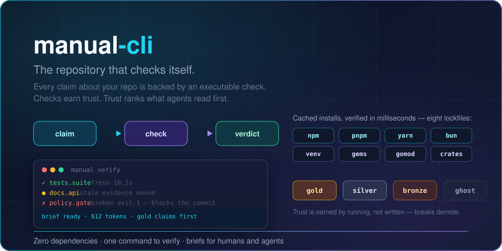
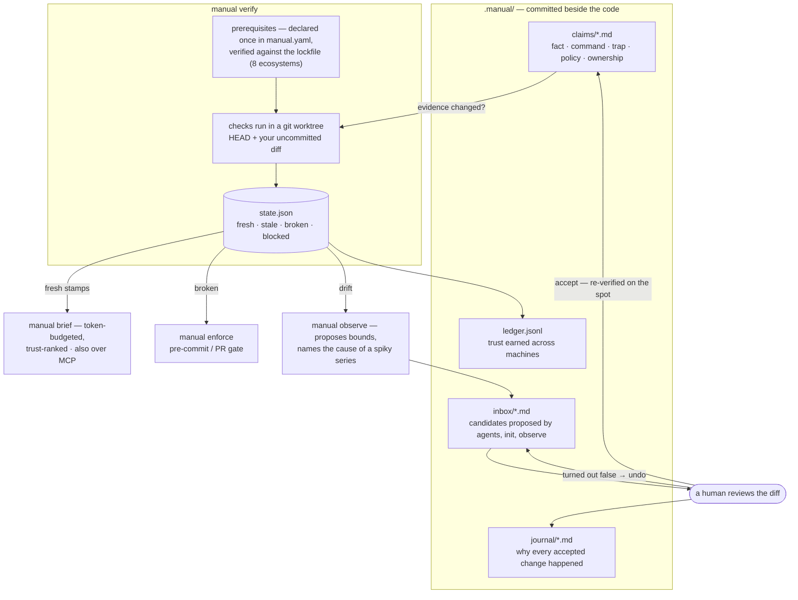

# manual-cli

[](https://github.com/phantomghost2023/manual-cli/actions/workflows/manual.yml)



**Self-verifying repository operating manual** — every claim about a repo is backed by an executable check, stamped fresh/stale/broken/blocked in `state.json`, and compiled into token-budgeted session briefs.

Zero dependencies. Node >= 20. No install needed.

> Linked from somewhere? This card is the repo's social preview: the repository's own claims, checked by its own tool — see [docs/social-preview.png](docs/social-preview.png) for the standalone image.

## How it fits together



Claims, checks, and the gate are the same object — enforcement cannot drift from documentation because there is only one file to drift. Agents propose; a human accepts; the accept is re-verified immediately, journaled with its reason, and revertible from any checkout.

```
manual verify   # is the manual still true?
manual brief    # what must an agent know before touching these files?
manual enforce  # compile policy claims into pre-commit/PR gates
manual observe  # flywheel: measurement drift -> inbox candidates
manual doctor   # is the manual itself healthy?
manual init     # discover claims by inspection, scaffold .manual/
manual inbox    # list/accept candidate claims (humans accept, agents propose)
manual hooks    # install/uninstall the pre-commit enforce gate
manual history  # what happened to each claim over time
manual journal  # why the manual changed, and revert any change later
manual ledger   # trust earned across machines (gold tier, recovery)
manual graph    # the evidence graph: dependencies, cycles, depth
manual report   # one self-contained HTML page: graph + cards + inbox
manual serve    # the same page as a live local dashboard
manual mcp      # MCP server: agents pull verified briefs over JSON-RPC
```

Time travel: `manual brief --at <ref> [files...]` reconstructs the manual as it
existed at any commit (claims that were candidate/retired at that ref are excluded).

## Quickstart

```bash
# against the bundled demo repo
node bin/manual.js verify --root demo --force
node bin/manual.js brief  --root demo demo/src/db/queries.ts demo/src/math.test.js
node bin/manual.js inbox  --root demo

# adopt it into a real repo
node bin/manual.js init --root /path/to/repo      # discovers claims by inspection
node bin/manual.js inbox --root /path/to/repo     # review candidates
node bin/manual.js verify --root /path/to/repo --force
```

## Commands

| Command | What it does |
|---|---|
| `verify [--force] [--diff [base]] [--only <ids>] [--no-setup] [--setup-force]` | Run checks (skipping claims whose evidence digests are unchanged and within TTL), stamp `state.json`, exit 1 if anything is broken or held back by an unmet prerequisite. `--diff` verifies only claims relevant to changed files, plus all policies and dependency closure. `--only` restricts the run to named claims plus their transitive dependencies — a claim whose deps are unstamped would otherwise report `blocked`, which says nothing about the claim. `--no-setup` trusts the environment (CI installs its own dependencies); `--setup-force` re-runs a prerequisite the cache considers done. |
| `setup [--plan] [--force] [--all] [--claim <id>] [--json]` | What the manual needs installed before it can say anything: every prerequisite declared in `manual.yaml`, deduplicated by command, with the claims that reference it and whether this machine has satisfied it. `--plan` prints the ordered, deduped sequence a full verify would execute — computed through the `requires` edges between steps — without running any of it; it exits 1 while any step is unsatisfied, so it works as a CI preflight. `--force` runs what claims need, `--all` includes declared steps no claim references, `--claim` narrows to one claim. Listing installs nothing. Exits 1 on a failed install or a prerequisite some claim requires but nobody declares. |
| `brief [--budget N] [files...]` | Token-budgeted briefing: claims relevant to the files in play, weighted by priority × glob specificity × trust tier; traps score double; `when: true` claims always included. |
| `enforce [--stage pre-commit\|pr]` | Runs every policy claim's check as a gate. The claim's check IS the gate — enforcement and documentation are the same object and cannot drift. |
| `observe` | Reads verify history in `state.json`, writes inbox candidates when measurements diverge from claim bounds: *tighten* (the bound sits far above what runs cost) or *relax* (the bound itself broke the claim). Proposed bounds respect the tail — at least 3× the median, 1.5× p90, and 1.1× the worst run seen — and it refuses to propose a tightening the observed tail would violate. Every proposal carries a *diagnosis* of why the series is spiky (cold start, trend, outlier, two clusters, correlated with free memory or machine load, cold-cache after an evidence change, or a single test dominating the suite), because naming the cause changes the right action. It also reports candidates that have gone *stale* (evidence moved since they were written). |
| `doctor` | Health report for the manual: never-verified claims, evidence changed since last verify, expired TTLs, broken claims, and prerequisites that are declared but unsatisfied (with the command that fixes them). |
| `init [--dry-run]` | Inspects package.json, lockfiles, test scripts, migrations, CODEOWNERS; scaffolds `.manual/`, a GitHub Actions workflow, and inbox candidates marked `origin: observed`. |
| `inbox [accept \| preview \| undo]` | List candidates. `preview <file>` shows the exact frontmatter change without touching anything. `accept <file>` merges `proposes.patch` into the target claim's frontmatter (no clobbering) or moves a whole-claim candidate into `claims/` — and then **re-verifies the affected claim**, exiting 1 with an undo token if the proposal turns out to be false. `undo <token>` restores the claim file byte-for-byte and puts the candidate back. |
| `hooks install\|uninstall\|status` | Manage the `.git/hooks/pre-commit` gate that runs `manual enforce` (marked block, preserves user hooks). |
| `mcp [--root dir]` | Speak MCP over stdio: `manual_brief`, `manual_verify`, `manual_doctor`, `manual_inbox` tools. Point your coding agent at `bin/manual.js mcp`. |
| `eject [--dry-run]` | Vendor the CLI into `tools/manual-cli/` so CI workflows and hooks run fully self-contained. |
| `watch [--debounce N]` | Editor-loop mode: re-verify claims affected by file changes (evidence globs + bidirectional dependency closure). `affectedClaims()` is exported for editor integrations. |
| `history [<claim-id>] [--json]` | Claim archaeology: state transitions, per-claim runtime trend (p50/p90/max over recorded runs), break count, mean time to recovery, the diagnosis of why the series is spiky, and the git provenance of the claim file. Joins three records — `state.json` verify history (machine-local), the committed trust ledger (cross-machine), and the commit history of the claim itself. |
| `journal [<id>] [--json]` | The audit trail for changes to the manual: one committed markdown file per accepted proposal, recording who accepted it, on which machine, the reason it was proposed, the exact diff, and the verify verdict that followed. `journal <id>` prints one entry; `journal revert <id>` restores the claim from any checkout and returns the candidate to the inbox — no local undo snapshot required. |
| `ledger [--json]` | The committed record of trust earned across machines (`.manual/ledger.jsonl`). Merged into every verify, so pass counts are the repository's history rather than one checkout's, gold tier finally needs a second machine to *exist* rather than merely to be simulated, and recovery timelines span machines. |
| `graph [--dot\|--mermaid\|--json]` | The evidence graph: nodes are claims, edges are `depends_on` (solid = required, dashed = optional). Reports cycles, dangling edges, isolated claims, and layer depth. Exits 1 on cycles or dangling edges. |
| `report [--out <file>] [--open]` | Writes `.manual/report.html` — a single self-contained page (no CDN, no build): inline SVG graph, one card per claim, tier/state badges, doctor issues, the flywheel inbox, and live filter controls. |
| `serve [--port N] [--open] [--pidfile <f>]` | The same page as a live loopback dashboard, regenerated per request, plus `/api/graph`, `/api/claims`, `/api/verify` (POST) and `/health`. Port failover: if N is taken it tries N+1 … N+19. Writes a pidfile so scripts can find and stop it. |
| `brief --at <ref>` | Historical brief: the manual as of a past commit, for debugging old releases. |

## Seeing the manual

The evidence graph has been a data structure since the first version; `report` and
`serve` make it something you can look at.

```bash
manual report --open            # static artifact you can commit as a CI artifact
manual serve --port 4242        # live dashboard; POST /api/verify re-runs the checks
manual graph --mermaid          # paste into a README or PR description
manual graph --dot | dot -Tsvg  # if you have graphviz
manual history                  # per-claim breaks, runtime trend, recovery time
```

Nodes are colored by state, edges follow `depends_on`, and clicking a node jumps
to the claim's card. Each card carries a runtime sparkline, its break count, and
where the claim came from in git. The report is one file with zero external
requests — it renders offline, in email, and in an artifact bucket.

### Undo that survives your laptop, and reasons that survive the author

`.manual/undo/` is fast and byte-exact, but it is local, pruned to 20 entries,
and dies with the dashboard process. `.manual/journal/` is the durable half:
one committed markdown file per accepted change, carrying the reason it was
proposed, the exact diff, the verifying verdict, the machine it happened on,
and the previous file content.

```bash
manual journal                                  # every accepted change, newest first
manual journal 20260921T194044Z-tests.suite     # one entry: why, diff, verdict
manual journal revert <id>                      # works from any checkout, or after a push
manual journal revert <id> --force              # when the claim moved on since (says so)
```

Reverting restores the claim byte-for-byte, journals the revert itself as a new
entry pointing back at the original, and puts the candidate back in the inbox so
the proposal stays reviewable. If the claim changed *after* the accept being
reverted, the revert is refused rather than quietly discarding those later
edits; `--force` overrides, in the CLI and in the dashboard (`409` plus a
*revert anyway* button). What it cannot do is un-push: the journal makes a
change *traceable and revertible*, not *secret*.

`serve` adds the two things a static file cannot do: **re-verify now**
(`POST /api/verify`) re-runs the real checks in a sandbox and reloads with fresh
stamps, and each inbox candidate gets a **preview & accept** button that shows
the exact frontmatter diff before a human applies it. Accepting a proposal is
the one step in this system that is deliberately never automatic — and when a
proposal is accepted, the affected claim is re-verified in place and the verdict
is rendered before you go anywhere: fresh, or *"proposal turned out false"* with
an **undo this change** button (`POST /api/inbox/undo`).

```
GET  /                the report           POST /api/verify          run the checks
GET  /api/graph       graph JSON           POST /api/inbox/accept    apply + verify a proposal
GET  /api/claims      claim JSON           POST /api/inbox/undo      revert an accepted one
GET  /health          liveness             GET  /api/inbox/preview   show a proposal's diff
GET  /api/inbox       list candidates      POST /api/journal/revert  undo an accepted change
```

The page also renders the **journal**: every accepted change with its reason,
machine, verdict and revert state — the same committed record `manual journal`
prints, with a revert button in the live dashboard and no button in the static
file (a committed artifact should not carry a mutation affordance).

## Claim file format (manual/v1)

One markdown file per claim in `.manual/claims/<id>.md`. Frontmatter is machine-checkable; prose is for humans; they travel together forever.

```markdown
---
schema: manual/v1
id: tests.demo
kind: command                  # fact | command | trap | policy | ownership
statement: The test suite runs with plain `node --test` and finishes in under a second.
priority: high                 # critical | high | normal
applies_to: ["src/**"]         # globs that pull this claim into a brief
evidence:
  files: ["src/**"]            # hashed for incremental verify
depends_on:
  - { id: tooling.modules, required: true }   # dep not fresh ⇒ blocked
check:
  requires: node               # prerequisite declared once in manual.yaml
  run: node --test
  expect: { exit: 0, max_ms: 30000 }
verify: on_change              # on_change | on_demand | always
provenance:
  author: mira
  origin: authored             # authored | observed | imported
  evidence: "suite is node:test since the repo was created"
lifecycle: accepted            # candidate | accepted | retired
---
Prose body restating the statement, plus ## Gotchas / ## Looks right / ## Do instead.
```

### Kinds → what "broken" means

| Kind | broken means | Effect |
|---|---|---|
| `fact` / `command` / `policy` | The claim is wrong or the repo changed | Red — fix doc or code; tier demotes |
| `trap` | The gotcha **no longer reproduces** | Amber — celebrate; auto-retire |
| `ownership` | Owner/lock no longer resolvable | Amber — review |

### Trust tiers

Claims earn trust by being executed, not by being written: `ghost` (imported, never verified) → `bronze` (asserted) → `silver` (≥1 executed pass) → `gold` (≥5 passes). Any `broken` demotes one tier. Brief weight follows the tier, so unverified agent-authored claims never shout louder than battle-tested ones.

### Checks

- `run` — shell (`bash -euo pipefail`), pass/fail via `expect: { exit, stdout_matches, stderr_matches, max_ms }`.
- `expr` — sandboxed predicate over a tiny read-only API: `exists()`, `read()`, `manifest()`, `env()`, `nodeMajor()`, `codeowners()`, `lockActive(owner, {withinDays})` (true when a branch named for that owner has recent commits or is checked out in a worktree — the coordination signal behind ownership claims).
- `enforce` — policy claims reuse the same check as a pre-commit/PR gate.

### Prerequisites: declared once, referenced by name

A command check that needs installed dependencies or a build step cannot prove
anything on its own. On a fresh clone `npm test` exits 127, and the claim used
to read **broken** — which blamed the repository for the checkout.

A repository does not have *one* prerequisite, it has an install per ecosystem
plus whatever build or codegen step the commands sit on. Those belong to the
repository, not to each claim, so they are declared once in
`.manual/manual.yaml`:

```yaml
# .manual/manual.yaml
setup:
  node:
    run: npm ci                  # or a build step: "make deps"
    evidence:                    # what decides whether the install is still valid
      - package.json
      - package-lock.json
    cache: ["node_modules"]      # the directories its success is measured by
  python:
    run: python3 -m venv .venv && .venv/bin/pip install -r requirements.txt
    evidence: ["requirements.txt"]
    cache: [".venv"]
    timeout_s: 900
```

```yaml
# .manual/claims/tests.suite.md
check:
  requires: [node, python]       # or one name, or a per-claim inline `setup:`
  run: pytest && npm test
```

- **Deduplication follows the command, not the claim.** A named prerequisite
  runs once per `(command, evidence)` pair no matter how many claims reference
  it, so ten claims requiring `node` pay for one install; a claim requiring
  `node` and `python` pays for two, once each, in the order it lists them (its
  own inline `setup:` runs last — the specific step on top of the installs).
- **A name nobody declares is a load error, not a skipped step.** The claim is
  reported `blocked` with `unknown prerequisite "nodejs"` and `verify`/`doctor`
  exit non-zero, because a check that runs without its install reports its own
  failure as the repository's truth.
- **`manual setup` is the inventory**: every declared prerequisite, the claims
  that reference it, and whether this machine has satisfied it. Declared but
  unreferenced is a fact about the repo, not a request to run it (`--force`
  warms what claims need; `--all` runs the rest). `init` writes the detected
  ecosystems here and points candidates at them by name.
- Per-claim `check.setup` still works, for the one claim with the one awkward
  step that is nobody else's business.
- **`blocked`, not `broken`.** A claim whose prerequisite did not complete is
  *untested*: it reports `blocked`, keeps the tier it had earned, and fails CI
  with the reason instead of the claim's name. "Untested is not disproven."
- **Once per (command, evidence) pair, not per verify.** The key is the command
  plus the *content* of its evidence, so bumping a lockfile re-installs and
  re-verifying untouched code does not; twelve claims requiring `node` need one
  install. The cache lives in `.manual/cache/` (gitignored — it describes a
  machine, not the truth), and it is only trusted while the directories it
  declares still exist: delete `node_modules` by hand and the next verify
  reinstalls it.
- **Install cost is not suite cost.** Prerequisites run before the clock starts, so
  `measured_ms` stays the check's own runtime and the flywheel's bounds keep
  meaning something.
- **Installs are not sandboxed.** They run in the checkout, exactly as a
  developer would, because that is where dependency trees belong and because a
  throwaway worktree would reinstall on every verify. Only the directories the
  setup declares are created, and only by the command it declares.
- **`init` detects it.** A command candidate on a checkout without dependencies
  arrives with the setup already declared from the repo's own package manager
  (npm/pnpm/yarn/bun, lockfile-aware); a check that fails with "Cannot find
  module" teaches the probe the same thing. `manual setup` shows what is
  declared and what is satisfied here; `manual setup --force` warms it.
- **`--no-setup` trusts the environment** (the CI path, where the workflow
  installs dependencies itself) — and refuses to call a claim broken when the
  prerequisite it declares is visibly absent. `--setup-force` re-runs an install
  the cache considers done.

One step usually sits on another: a build needs the install, codegen needs the
build. Writing the edge down means the order is computed instead of hand-kept,
so a claim that lists its requirements in the wrong order still runs them in the
only order that works.

```yaml
setup:
  node:  { run: npm ci }
  build:
    run: make build
    requires: [node]          # the install comes first, whatever a claim says
    cache: ["dist"]
```

`manual setup --plan` prints the ordered, deduped sequence *before* anything
runs — how many installs a full verify will pay for, in what order, and which
claims each one is for:

```console
$ manual setup --plan
prerequisite plan — 1 step(s), 1 claim(s), in the order a full verify runs them

  1. node → npm install  tests.suite  will run
       re-checked with: builtin:npm

0 satisfied, 1 to establish — verify pays for each once, in this order.
```

A cycle is refused (`prerequisite cycle a → b → a — no order satisfies it`)
rather than resolved into a sequence that cannot run, and the steps inside it
are left out of the plan's order for the same reason. A dependency on a name
nobody declares is reported against the step that wanted it. Exit status 1 while
anything is unsatisfied makes `manual setup --plan` usable as a CI preflight.

#### A satisfied prerequisite is verified, not merely remembered

"It ran once" is not evidence that the tree is still there. Three layers decide,
cheapest first: the declared directories exist (a stat each); a **witness** of
their immediate entries (a readdir, which catches a wiped or replaced tree); and
`verify:` — the layer that can tell a stale tree from a complete one.

```yaml
setup:
  node:
    run: npm ci
    evidence: ["package.json", "package-lock.json"]
    cache: ["node_modules"]
    verify:
      builtin: npm             # every package the lockfile names is installed
    share: true                # other checkouts on this machine may borrow it
```

- **Eight ecosystems, one question.** Every Node package manager a repo can
  use is covered. A builtin compares an installed tree against the lockfile that
  describes it by reading directory listings, not by running the package
  manager's own check:

  | builtin | lockfile | tree | what is compared |
  | --- | --- | --- | --- |
  | `npm` | `package-lock.json`, `npm-shrinkwrap.json` | `node_modules` | every declared package path exists (lockfileVersion 1 and 3) |
  | `pnpm` | `pnpm-lock.yaml` | `node_modules/.pnpm` | every resolved package has a store directory, and pnpm's own copy of the lockfile matches |
  | `yarn` | `yarn.lock` | `node_modules` | v1: the pattern → resolved-URL map in `.yarn-integrity` matches the lockfile, and every directory it linked is on disk. berry: every location `.yarn-state.yml` lists exists, and every locator is resolved |
  | `bun` | `bun.lock` | `node_modules` | every path the lockfile keys resolve to is installed (hoisted), or every resolved package has its own store directory under `node_modules/.bun` (isolated linker) |
  | `venv` | `requirements.txt`, `poetry.lock`, `Pipfile.lock`, `uv.lock` | `.venv` (both `Lib/site-packages` and `lib/python3.x/site-packages`) | every declared distribution is installed, at the declared version |
  | `gems` | `Gemfile.lock` | `vendor/bundle` (`BUNDLE_PATH` honoured) | every `GEM` spec has a `specifications/*.gemspec` |
  | `gomod` | `go.mod` | `$GOMODCACHE`, or `vendor/modules.txt` | every required module is downloaded: source for direct dependencies, `.mod` for the module graph |
  | `crates` | `Cargo.lock` | `$CARGO_HOME/registry`, `vendor/` | every registry package has extracted source or a verified archive |
  | `auto` | — | — | picks from the setup's own `evidence`, or the one lockfile in the checkout, and says which it picked |

  On a 403-package express tree `npm` answers in **~64ms** against **10.9s** for
  the obvious command, `npm ls --depth=0` — which is why the easy answer was
  never being run. On real trees the new two answer in **2–5ms**: a yarn 1 clone
  (`2 package pattern(s) present, matching yarn.lock; 1 linked directory present
  on disk`), a berry clone (`3 package(s) linked on disk, all of them resolved by
  yarn.lock`) and a bun clone (`6 package(s) present, matching bun.lock
  (hoisted)`). `lockfile` is the older spelling of `npm` and still resolves.
  A `verify:` command is still accepted for anything not covered; the map form is
  required for builtins so a bare word is never ambiguous.
- **Yes, no, and "nothing to compare against" are different answers.** A repo can
  ship `.npmrc` with `package-lock=false` (express does) and commit no lockfile
  at all; treating that as "no" would reinstall on every verify for a repository
  that is perfectly fine. It is reported instead — `⚠ cannot run here: no
  package-lock.json or npm-shrinkwrap.json in this checkout` in `manual setup`
  and in the plan — because "unverifiable" and "verified" are different facts
  about a tree. The builtin is only as good as the lockfile's provenance.
- **"No" is only said when the declared command can repair it.** Every verdict
  was measured against the package manager that owns the tree: `npm ci` restores
  a deleted nested package, `pip install -r` restores a `dist-info`, `bundle
  install` restores a gemspec, `go mod download` restores a module. Where the
  repair does *not* happen a builtin reports instead of judging, because a
  verdict there would rebuild on every verify and never change its answer —
  measured twice on pnpm 11 (a satisfied `pnpm install` leaves a deleted
  `node_modules/.pnpm/<pkg>` and a modified `node_modules/.pnpm/lock.yaml`
  alone, even with `--force`), on bun's isolated linker (a deleted
  `node_modules/.bun/<pkg>@<version>` is answered with "Checked 6 installs
  across 32 packages (no changes)") and true of `crates`, whose `Cargo.lock`
  covers dev-dependencies a plain build never fetches. Those steps print what
  they saw:

  The same rule decides what yarn's classic generation is allowed to say, and
  there it changed the command `init` writes. Classic yarn's integrity file
  records *which lockfile the tree came from* and nothing about the tree: delete
  `node_modules/is-odd` and both the file and `yarn install --frozen-lockfile`
  say the install is fine ("Already up-to-date", 0.2s, tree still damaged).
  `--check-files` and `--force` do re-link it, in the same 0.2s — so a classic
  repo's discovered prerequisite is `yarn install --frozen-lockfile
  --check-files`, and a linked directory that is missing is a verdict that
  command repairs. Berry rejects that flag ("Unsupported option name"), and does
  not need it: a plain `yarn install` re-links a deleted location in 155ms. On a
  tree whose declared command is just `yarn install --frozen-lockfile`, the
  missing directory is reported rather than judged:

  ```console
  ⚙ setup: pnpm install --frozen-lockfile — reused, not re-confirmed: 1/2 package(s) the lockfile lists are not in node_modules/.pnpm, e.g. is-number@6.0.0; node_modules/.pnpm/lock.yaml matches pnpm-lock.yaml — not a verdict: a satisfied `pnpm install` re-imports only when the lockfile itself changes
  ⚙ setup: yarn install --frozen-lockfile — reused, not re-confirmed: 1/1 top-level package(s) yarn linked are not in node_modules, e.g. is-odd (installed for is-odd@3.0.1) — not a verdict: a satisfied `yarn install` trusts .yarn-integrity and leaves them missing (measured: "Already up-to-date", 0.2s). `yarn install --check-files` (or `--force`) re-links them in the same 0.2s
  ```
- **`init` writes the verifier for the ecosystem it found** (`verify: { builtin:
  venv }`), never `auto` — discovery knows which one it just detected, so a human
  reading `manual.yaml` does not have to work it out. It also writes a
  platform-correct virtualenv command (`.venv/Scripts` on Windows, `.venv/bin`
  everywhere else), because a prerequisite that only works on the machine that
  discovered it is a prerequisite that fails on the next one.
- **A distrusted install is rebuilt, and the reason is printed**:

  ```console
  ⚙ setup: npm install (cached install distrusted — verify: 3/403 installed package(s) missing, e.g. node_modules/mocha/node_modules/brace-expansion)
  ⚙ setup: npm install (rebuilding the distrusted install)
  ```

  The witness alone could not have seen this: losing `node_modules/mocha/node_modules`
  does not change the immediate contents of `node_modules`. Without a verifier
  the same stale tree stays trusted — that boundary is deliberate, and the plan
  says so out loud (`satisfied here (re-checked with builtin:npm before use)`).
- **`share: true` lets another checkout borrow a verified tree** instead of
  installing it again: the store records *where* an install was verified (not a
  copy of it), keyed by platform + command + evidence content, and a checkout
  whose evidence matches links the other's directories. It is opt-in because the
  tree is then genuinely shared — mutating it in one checkout mutates it in the
  other. The record is re-verified *now*, at the moment of borrowing: damage the
  source tree and the next checkout installs for itself rather than inheriting
  the damage.

### Evidence & incremental verify

Each claim hashes its evidence inputs (file globs → sorted path+size+content digests; env vars → salted hashes, values never stored; runtime versions). Digest unchanged + still fresh + within TTL ⇒ skip. Subsecond on the hot path.

Checks run in a throwaway `git worktree` (HEAD + overlay of your uncommitted diff) so mutating checks can't dirty the checkout; non-git roots run in place. The sandbox strips `NODE_TEST_CONTEXT` so results can't be corrupted by the parent process's test-runner state (a bug the tool caught in its own test suite).

It also links dependency trees that git ignores (`node_modules`, `.venv`, `vendor/bundle`) into the worktree — a verifier that can't run the repo's own tests isn't verifying anything — and puts their `bin/` directories on `PATH`, the way `npm run` does, so a claim that runs `mocha test/` works and isn't reported as a failing suite. It removes those links itself before teardown: a recursive delete follows a Windows junction into the target, which emptied the developer's `node_modules` while leaving the directory in place.

### The flywheel

1. Sessions (or `manual observe`) write *observation records* to `.manual/inbox/` — "p90 was 45s and the worst run 47s; the claim allows 120s — tighten to 69s."
2. A human reviews (`manual inbox preview <file>`, or the dashboard's diff) and accepts it.
3. Accepting is **not** the end: the affected claim is re-verified immediately, with force. A proposal that turns out to be false exits 1 and hands back an undo token.
4. `manual inbox undo <token>` restores the claim byte-for-byte and returns the candidate to the inbox.
5. The accept is written to `.manual/journal/` — committed, portable, and carrying the reason — so the change can be traced and reverted from any checkout later (`manual journal revert <id>`).
6. Every session that passes through the repo leaves the manual slightly truer than it found it.

This matters because a proposal is an *observation*, and observations can be wrong. The
first real proposal this tool ever generated asked to tighten `tests.suite` from 120s to
11s based on a stale 3×-p50 heuristic; a `history` of the same claim showed a p90 of 25s
and a worst run of 47s. Accepting it would have made the claim flap forever. The tool
therefore both refuses to *propose* bounds the tail would violate and refuses to silently
*keep* a proposal that fails its own check.

A proposal now says *why* the numbers look the way they do, because the cause
decides the fix: a cold first run wants a warm-up, a cold-cache spike after an
evidence change is artifact rebuilding, a memory or load correlation is the
machine rather than the code, and a single test dominating the suite means the
bound is a proxy for that test — which is worth naming before anyone tightens
it. The diagnosis is recorded in the candidate, in the journal entry, and in
`manual history`.

## Layout

```
.manual/
  manual.yaml        # brief budget, verify timeouts, CI globs, declared prerequisites
  claims/*.md        # accepted claims
  inbox/*.md         # candidates proposed by sessions / init / observe
  journal/*.md       # committed audit trail: each accepted change + its reason
  ledger.jsonl       # committed trust ledger: passes per claim per machine
  state.json         # gitignored: stamps, digests, trust history, env salt
  undo/*.json        # gitignored: local byte-exact undo snapshots (pruned to 20)
  cache/setup.json   # gitignored: which prerequisites this machine has satisfied
.github/workflows/manual.yml   # written by init when .github exists
```

## Provenance of this tool

The demo ships a genuine trap discovered while building it: `node --test --test-reporter=pipe` exits 7 (ERR_INVALID_ARG_VALUE). The trap claim's check reproduces the gotcha and passes *while the trap is live*; if Node ever makes it valid, the claim flips broken and retires itself. Dogfooding also caught: `NODE_TEST_CONTEXT` leaking into checks, a JSON-in-YAML quoting bug, a spread-order bug that silently inverted expr results, and the spec's own wrong exit code — each fixed by evidence, not opinion. This repo runs its own manual: claims verify it, the pre-commit gate guards its commits, and its first flywheel proposal (tighten `tests.suite`) is sitting in the inbox awaiting human review.

## Test

```bash
npm test        # 266 tests across 50 suites (seeded fuzzing, real-git integration, HTTP end-to-end)
npm run bench   # 500-claim scale benchmark (see numbers below)
```

Scale (500 synthetic claims, Windows, cold process, median of 3 runs on a busy
machine): warm verify 0.17s · verify --force 0.7s (500 expr checks) · doctor
0.2s · brief 0.17s · parsing all 500 claims 0.8–2.2s, which is the dominant cost
and swings with machine load. Evidence digests are deduped per evidence spec and
parsed claims are stat-cached per process, so the tool's own limit is check cost,
not claim count — see [docs/FIELD-NOTES.md](docs/FIELD-NOTES.md).

Docs: [docs/TUTORIAL.md](docs/TUTORIAL.md) (5-minute walkthrough) · [docs/manual.1.md](docs/manual.1.md) (reference) · [docs/FIELD-NOTES.md](docs/FIELD-NOTES.md) (what happened on a real repo it didn't grow up with) · [completions.bash](completions.bash)

## This repo's own manual

`manual-cli` documents itself, and the documentation is enforced:

- `docs.commands` fails if the README stops mentioning a command the CLI exposes.
- `tooling.cli-surface` fails if `src/cli.js` loses a command handler.
- `docs.commands` depends on `tooling.cli-surface`, so a drifted surface blocks
  the doc claim rather than letting it report a stale pass.
- `policy.claims-valid` is a real pre-commit gate: a malformed claim cannot be committed.

Its own history is the honest part: `manual history tests.suite` shows it broke
twice, both times because a check was flaky rather than because the claim was
wrong — which is exactly the signal a per-claim timeline exists to surface.
